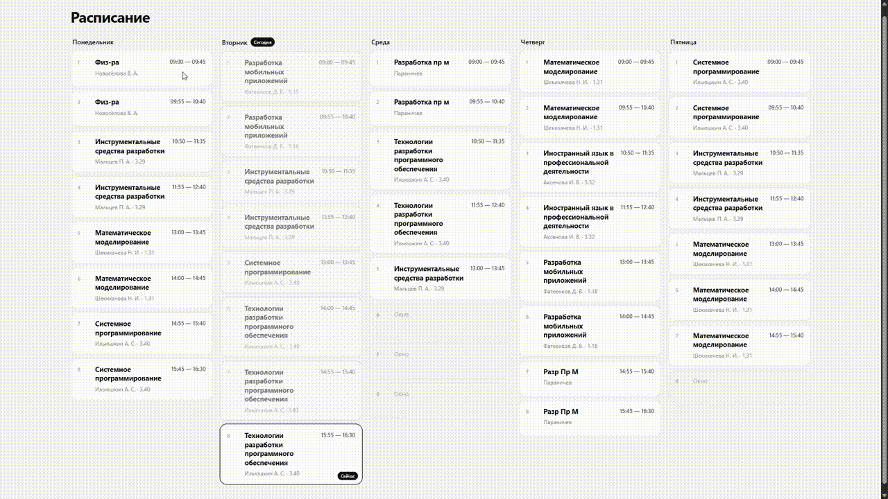

# College Schedule




## Зачем я это сделал

Обучаясь в колледже на программиста, в новом учебном году я узнал, что программу для расписания на этот год не оплатили.
Мне пришлось применить свои навыки для разработки собственного решения, с которым колледж не смог справиться своими силами.
Проект заточен под нужды конкретной группы, поэтому он вряд ли подойдёт учебным организациям.
Тем не менее он отлично подойдет людям, оказавшимся в похожей ситуации.

## Как это работает

Приложение состоит из трёх основных частей:

```text
Browser
   │
   ├── public/          → HTML + CSS + JavaScript
   │
   ▼
Cloudflare Worker      → API и авторизация
   │
   ▼
Cloudflare D1          → расписание
```

Публичная страница получает расписание через `GET /api/schedule`.

Админка использует пароль из Cloudflare Secret и получает HttpOnly-сессию. Изменения уроков отправляются в Worker через `PUT /api/lesson/:id`, после чего сохраняются в D1.

На клиенте дополнительно реализованы:

- автоматическое определение текущего урока;
- выбор следующего урока во время перемены;
- приглушение уже прошедших уроков;
- автоматический выбор текущего дня;
- мобильные вкладки дней;
- автопрокрутка к текущему уроку на мобильных устройствах;

## Возможности

### Для студентов

- расписание на пять дней;
- до восьми уроков в день;
- адаптивная версия для телефона;
- текущий урок выделяется автоматически;
- прошедшие уроки визуально приглушаются;
- во время перемены подсвечивается ближайший следующий урок.

### Для администратора

- вход по паролю;
- сессия в HttpOnly cookie;
- редактирование названия, преподавателя, кабинета и времени;
- сохранение отдельного урока;
- кнопка «Сохранить всё»;
- маска кабинета `1.19`;
- маска времени `09:00 — 09:45`.

## Стек

- HTML5
- CSS3
- JavaScript
- Cloudflare Workers
- Cloudflare D1 (SQLite)
- Wrangler

## Структура проекта

```text
college-schedule/
├── public/
│   ├── index.html
│   ├── admin.html
│   ├── favicon.svg
│   ├── css/
│   │   └── style.css
│   └── js/
│       ├── schedule.js
│       └── admin.js
│
├── worker/
│   └── index.js
│
├── schema.sql
├── seed.sql
├── wrangler.toml.example
├── package.json
├── package-lock.json
└── .gitignore
```

## Как запустить свой экземпляр

### 1. Клонировать репозиторий

```bash
git clone https://github.com/f1cus7/college-schedule.git
cd college-schedule
```

### 2. Установить зависимости

```bash
npm install
```

### 3. Установить Wrangler

Wrangler уже указан в зависимостях проекта, поэтому отдельная глобальная установка не требуется.

### 4. Создать D1

Авторизуйтесь в Cloudflare:

```bash
npx wrangler login
```

Создайте базу:

```bash
npx wrangler d1 create college-schedule
```

Команда вернёт `database_id`. Скопируйте его.

### 5. Создать `wrangler.toml`

Сделайте копию шаблона:

```bash
copy wrangler.toml.example wrangler.toml
```

На Linux/macOS:

```bash
cp wrangler.toml.example wrangler.toml
```

В `wrangler.toml` замените:

```toml
database_id = "YOUR_DATABASE_ID"
```

на ID своей D1-базы.

### 6. Создать таблицы

```bash
npx wrangler d1 execute college-schedule --remote --file=./schema.sql
```

Затем заполнить расписание начальными пустыми слотами:

```bash
npx wrangler d1 execute college-schedule --remote --file=./seed.sql
```

В проекте используется пять дней и до восьми уроков в день — всего 40 слотов.

### 7. Создать пароль администратора

Для локальной разработки создайте `.dev.vars`:

```env
ADMIN_PASSWORD=your-password
```

Файл уже добавлен в `.gitignore` и не должен попадать в Git.

Для продакшена создайте Cloudflare Secret:

```bash
npx wrangler secret put ADMIN_PASSWORD
```

### 8. Локальный запуск

```bash
npx wrangler dev
```

После запуска откройте адрес, который покажет Wrangler.

Публичная страница:

```text
/
```

Админка:

```text
/admin
```

### 9. Деплой

```bash
npx wrangler deploy
```

После успешного деплоя Wrangler покажет адрес вида:

```text
https://your-project.your-subdomain.workers.dev
```

## API

### Получить расписание

```http
GET /api/schedule
```

### Проверить авторизацию

```http
GET /api/auth
```

### Войти

```http
POST /api/login
Content-Type: application/json

{
  "password": "your-password"
}
```

### Изменить урок

```http
PUT /api/lesson/:id
Content-Type: application/json

{
  "name": "Математика",
  "teacher": "Иванов И.И.",
  "room": "1.19",
  "time": "09:00 — 09:45"
}
```

### Выйти

```http
POST /api/logout
```

## Безопасность

Пароль администратора не хранится в исходном коде. Для локальной разработки используется `.dev.vars`, а для Cloudflare — Secret `ADMIN_PASSWORD`.

Файлы `.dev.vars`, `.wrangler/`, `node_modules/` и локальный `wrangler.toml` исключены из Git.